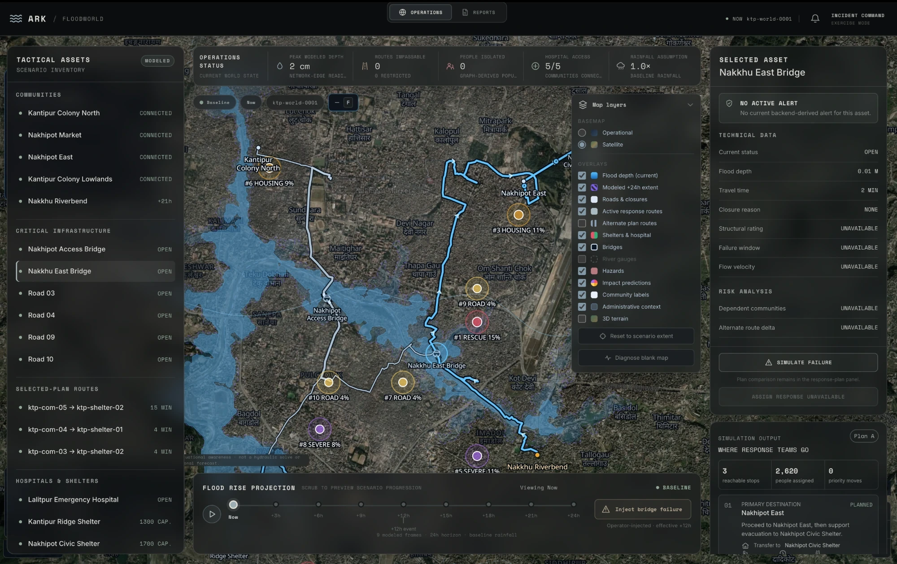
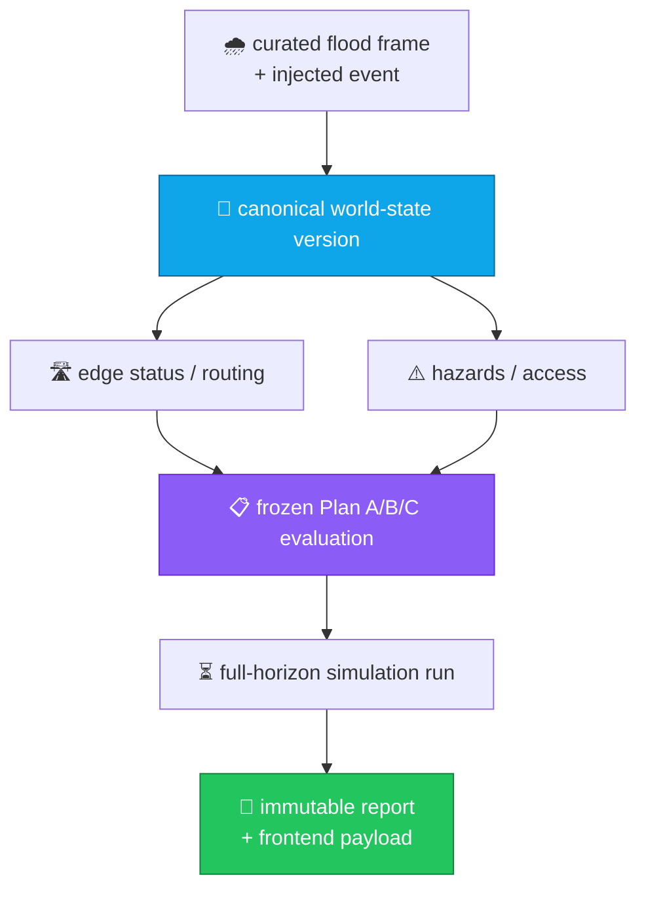

<div align="center">

<h1>🌊 &nbsp;THE ARK</h1>

<h3>A real-time world model for flood emergencies</h3>

<p>
One canonical world state. Every closure, safe route, isolated community,<br/>
hazard and response plan is <em>derived</em> from it — never guessed, never drawn by hand.
</p>

<p>
  
  
  
  
  
  
</p>

<p>
  
  
  
  
</p>

<br/>



<sub><b>Incident command, exercise mode.</b> Modeled flood extent over the Nakkhu corridor, live route status, prediction pings, and a 24-hour scrub timeline.</sub>

The hybrid Incident Copilot requires an Anthropic API key for open-ended questions
and generated map briefings. Exact map-status lookups and supported field
updates remain deterministic and work without Claude.

```bash
export ANTHROPIC_API_KEY="your-key"
export ANTHROPIC_MODEL="claude-sonnet-4-6"
```

```bash
PYTHONPYCACHEPREFIX=/private/tmp/pycache-the-ark \
python3 -m uvicorn apps.api.main:app --reload
```

</div>

---

## What this is

The Ark is a **map-centric, deterministic, replayable** disaster-response world model. The MVP simulates a Nakkhu River flood across Kathmandu and Lalitpur and answers the questions an incident commander actually asks:

> *Which roads are gone? Who is cut off, and in how many hours? Can an ambulance still reach the hospital? If this bridge fails, which plan survives?*

Everything on screen is computed server-side from one canonical world state and handed to the browser fully derived. **The frontend recalculates no domain logic** — the map is a projection of truth, not a second source of it.

> [!IMPORTANT]
> The scenario fixture is **synthetic demonstration data**. The historical impact model is **research-only**. Neither is validated for live dispatch or operational guidance.

<br/>

## Highlights

<table>
<tr>
<td width="50%" valign="top">

### 🗺️ Terrain-derived flood surface
Water isn't drawn — it's **computed**. AWS Terrarium DEM tiles are decoded, depressions filled, D8 flow routed to find the channel, and height-above-nearest-drainage contoured into four depth bands. Terrain gives the shape; canonical per-edge depths give the growth curve.

</td>
<td width="50%" valign="top">

### 🛣️ Streets, not rectangles
`network:snap` routes every scenario edge along real OpenStreetMap centrelines; bridges take only the ~200 m that actually crosses water. Topology, travel times and every domain result are **unchanged** — routing never reads geometry.

</td>
</tr>
<tr>
<td width="50%" valign="top">

### ⏱️ Nine frames, instant scrub
Every modeled frame loads on start, so the timeline scrubs and plays back with zero latency and the sparklines plot real per-frame values. Playback advances one 3-hour frame every 2.4 s across a 24-hour horizon.

</td>
<td width="50%" valign="top">

### 💥 Counterfactual injection
Inject the Nakkhu East Bridge failure and the world recomputes — closures, safe paths, isolation clocks and Plan A/B/C scores — while stale results are retained for comparison rather than silently overwritten.

</td>
</tr>
<tr>
<td width="50%" valign="top">

### 🧾 Immutable audit trail
An explicit full-horizon run freezes its event set and fixture digest, persists all world-state snapshots to SQLite, and emits **one immutable report**. Browsing a frame creates nothing. Exports render stored findings — they never recalculate.

</td>
<td width="50%" valign="top">

### 💸 Zero tile bill
MapLibre GL over self-hosted **Protomaps PMTiles**. No token, no account, no metered tile API. A range-request extract pulls ~20 MB instead of the 138 GB planet, and production is plain static hosting on S3/R2/any CDN.

</td>
</tr>
</table>

<br/>

## Quickstart

<details open>
<summary><b>1 — Install &amp; verify</b></summary>

```bash
npm install --prefix apps/web
npm test
```

</details>

<details open>
<summary><b>2 — Run the API</b></summary>

```bash
PYTHONPYCACHEPREFIX=/private/tmp/pycache-the-ark python3 -m uvicorn apps.api.main:app --reload
```

</details>

<details open>
<summary><b>3 — Run the dashboard</b></summary>

```bash
npm run dev:web
```

Open **`http://127.0.0.1:5173`**. Vite proxies `/api` to FastAPI on port `8000`.

</details>

## Deploy (hackathon)

For a public demo on Render’s free Hobby plan, follow
`docs/render-deploy-handoff.md`. Use a GoDaddy promo for a domain only, not for
hosting.

The Kantipur PMTiles archive ships at `apps/web/public/basemap/kantipur.pmtiles`. Refresh it with `npm run basemap`. If it's missing or MapLibre fails to start, the dashboard falls back to a self-contained SVG schematic of the *same derived state* and says why, so the scenario stays inspectable offline and in CI.

<br/>

## Architecture



The world state is the shared source of truth. Physics publishes flood conditions; routing translates them into infrastructure consequences; scenarios branch and score immutable snapshots; the API returns the derived result.

| Module | Responsibility |
| :-- | :-- |
| `data/scenarios/kantipur-river/` | Deterministic topology, flood, plan, event and context fixtures |
| `services/physics/` | Flood-surface generation and normalized edge-level depths |
| `services/routing/` | Edge derivation, graph construction, safe paths, access, time-to-isolation |
| `services/scenarios/` | Fixture validation, plan scoring, invalidation, event recomputation |
| `services/reports/` | Run orchestration, delta analysis, SQLite persistence, export rendering |
| `apps/api/` | Strict Pydantic wire models + FastAPI endpoints |
| `apps/web/` | React operations shell, MapLibre map, timeline, incident focus |
| `packages/shared-types/` | TypeScript wire contracts for frontend consumers |

**Stable boundaries.** Flood producers never mutate route or plan results. Routing consumes the canonical frame and optional active events. Scenario evaluation consumes a frozen derived state. Agents may *explain* completed results but can never alter a safety field or a score.

<br/>

## The scenario

<table>
<tr><td><b>Area</b></td><td>Nakkhu River corridor — Kathmandu &amp; Lalitpur Metropolitan City</td></tr>
<tr><td><b>Assets</b></td><td>5 communities · 2 bridges · 1 hospital · 2 shelters</td></tr>
<tr><td><b>Horizon</b></td><td>9 flood frames at 3-hour intervals, now → +24h</td></tr>
<tr><td><b>Anchors</b></td><td>now / +6h / +12h / +24h depths are canonical; intervening frames are explicitly labeled linear interpolations</td></tr>
<tr><td><b>Event</b></td><td>Operator-injected Nakkhu East Bridge failure, effective +12h</td></tr>
</table>

<br/>

## Map design

<details>
<summary><b>Visual grammar</b> — shape carries type, colour carries status</summary>

<br/>

- **Shape = entity, colour = status.** Communities are circles, shelters houses, the hospital a cross, hazards triangles, closures a crossed circle. A shelter that can't be reached is still a house, just muted.
- **Solid = current, dashed = modeled.** Current flood extent, the active route and confirmed closures are solid; the +24h envelope and alternate plans are dashed. Operator-injected state is **amber**, so an event the operator caused never reads as an observation.
- **Hazards are drawn on the thing that is hazardous.** A blocked road is restyled along its own geometry with a heavier casing and a status label; a failed bridge is marked on that span, not on a marker beside it.
- **Detail arrives with zoom.** Far out: flood extent, network, communities, critical hazards. Closer: facility labels, closures, routes. Closest: depth bands, population, per-segment status.

The OSM basemap is deliberately restyled for operations — POI and address symbols dropped, minor roads faded and held until z13, buildings until z15, waterways *brightened* rather than suppressed. The flood story is a river story. Place names stay legible throughout.

</details>

<details>
<summary><b>Layers</b> — what the operator can toggle</summary>

<br/>

Flood depth (current) · modeled +24h extent · roads &amp; closures · active response routes · alternate plan routes · shelters &amp; hospital · bridges · river gauges · hazards · impact predictions · community labels · administrative context.

The basemap is a radio choice between the operational vector style and satellite imagery, with 3D terrain as a separate toggle. River gauges are listed but disabled — the fixture has no gauge observations yet — and alternate plan routes are off by default.

| Layer | Source | Cost |
| :-- | :-- | :-- |
| Vector basemap | Protomaps PMTiles from OpenStreetMap, self-hosted | Free (ODbL attribution) |
| Terrain DEM | AWS Open Data terrain tiles, Terrarium-encoded | Free, no key |
| Satellite imagery | Esri World Imagery | Free with attribution — confirm terms for your deployment |
| Glyphs &amp; sprites | Protomaps basemap assets | Free, self-hostable |

</details>

<details>
<summary><b>Motion</b> — two things move, and both move because the state changed</summary>

<br/>

Response teams travel the selected plan's routes, staggered so they don't run in lockstep, with destination and ETA shown only for the focused route. A route crossing a failed edge carries **no team**, because no team is driving it.

Separately, a hazard that has just escalated to critical pulses for ~5 seconds and stops — one at a time, never on first load, cancelled early if the operator selects it. Hazard IDs carry the world-state version and change every frame, so escalation is tracked per *asset*; across a full nine-frame baseline that fires twice.

Both effects share one animation frame loop that parks itself when idle, and **neither runs under `prefers-reduced-motion`** — teams are placed but held still.

</details>

<details>
<summary><b>Interaction</b> — incident focus, fullscreen, prediction pings</summary>

<br/>

**Incident focus.** Click a community, road, bridge or hazard — on the map or in either rail — and the camera frames the affected area, everything outside the incident dims, and a panel states the affected population, the nearest reachable facility, the route time and what has become unreachable. *Exit focus* restores the full picture.

**Fullscreen.** Press <kbd>F</kbd>, or use the map toolbar toggle. It expands the whole shell rather than the map panel alone, so the tactical list, asset panel and timeline stay put and only browser chrome is reclaimed. Where the Fullscreen API is refused — an embedded pane, a kiosk frame, a restrictive Permissions-Policy — the shell expands to fill the viewport instead, so the shortcut always does something. <kbd>Esc</kbd> leaves either mode.

**Prediction pings** are hoverable. Each card separates current timeline risk from the shared event prior and shows nearby modeled flood depth, exposed population, location-specific responder priority, why the POI was flagged, and the recommended action. They're drawn in their own colour family — keyed to *impact target* rather than status — so a model prediction is never read as an observed closure.

</details>

<br/>

## The impact model

A **frozen CatBoost prior** trained on **4,869 location-level flood episodes (1971–2023)**, consolidated from 5,349 DesInventar and BIPAD reports, projected across ten research-only operational POIs on the timeline and map.

Every candidate was evaluated four ways — holding out complete **years**, complete **districts**, complete **HydroBASINS level-6 catchments**, and complete **four-day nationwide storm windows** — so reports from the same storm in different cities can't straddle the train/validation split.

| Candidate | Mean macro ROC-AUC | Mean RMSE |
| :-- | --: | --: |
| Logistic regression | 0.6320 | 0.4258 |
| Histogram gradient boosting | 0.6613 | 0.4219 |
| Extra Trees | 0.6625 | 0.4190 |
| Random forest | 0.6649 | 0.4184 |
| Soft-voting ensemble | 0.6738 | 0.4170 |
| **CatBoost** ✅ | **0.6760** | **0.4166** |

The September 2024 Nakkhu event is a **locked holdout** — not used in training, feature selection, model selection, threshold selection or tuning, and the 0.5 classification threshold is unchanged after evaluation.

> [!NOTE]
> The historical prior is recorded in provenance as research context. It does **not** feed routing, isolation, plan scoring, or report conclusions. Full methodology: [`docs/model-evaluation.md`](docs/model-evaluation.md).

<br/>

## API

<details>
<summary><b>Endpoints</b></summary>

<br/>

| Method | Path |
| :-- | :-- |
| `GET` | `/health` |
| `GET` | `/scenarios/kantipur-river/bootstrap` |
| `GET` | `/scenarios/kantipur-river/baseline` |
| `GET` | `/scenarios/kantipur-river/frames/{frame_id}` |
| `GET` | `/scenarios/kantipur-river/frames/{frame_id}?events={event_id}` |
| `POST` | `/scenarios/kantipur-river/events/{event_id}` |
| `POST` | `/scenarios/kantipur-river/runs` |
| `GET` | `/scenarios/kantipur-river/runs` |
| `GET` | `/scenarios/kantipur-river/runs/{run_id}` |
| `GET` | `/reports/{report_id}` |
| `GET` | `/reports/{report_id}/export?format=json\|csv\|html` |
| `GET` | `/docs` · `/openapi.json` |

Set `THE_ARK_REPORT_DB_PATH` to override the default `data/runtime/the-ark.sqlite3` location.

</details>

<br/>

## Scripts

| Command | What it does |
| :-- | :-- |
| `npm test` | Full Python suite — fixtures, routing, scenarios, reports |
| `npm run dev:api` | FastAPI with reload |
| `npm run dev:web` | Vite dev server (fetches the basemap if missing) |
| `npm run build` | Typecheck + production frontend build |
| `npm run basemap` | Refresh the Kantipur PMTiles extract (`FORCE=1` to rebuild from the planet) |
| `npm run flood:generate` | Regenerate the terrain-derived flood surface |
| `npm run flood:restore` | Restore the hand-authored `flood-polygons.curated-v1.geojson` |
| `npm run network:snap` | Snap scenario edges to OSM street centrelines |
| `npm run network:restore` | Restore the authored straight-line network |

Both flood surfaces and both networks pass the fixture contract and the full test suite.

<br/>

## Documentation

| Document | Contents |
| :-- | :-- |
| [`docs/architecture.md`](docs/architecture.md) | Data flow, module boundaries, run/report lifecycle |
| [`docs/api-contract.md`](docs/api-contract.md) | Endpoint payload semantics |
| [`docs/world-state-contract.md`](docs/world-state-contract.md) | Canonical world-state shape |
| [`docs/scenario-contract.md`](docs/scenario-contract.md) | Fixture rules and separation of concerns |
| [`docs/kantipur-river-topology.md`](docs/kantipur-river-topology.md) | Network topology reference |
| [`docs/model-evaluation.md`](docs/model-evaluation.md) | Model card, splits, ablations, holdout |
| [`data/scenarios/kantipur-river/SOURCES.md`](data/scenarios/kantipur-river/SOURCES.md) | Provenance and licensing |

<br/>

---

<div align="center">
<sub>
Administrative boundaries are visual context only and are not loaded by routing or scenario services.<br/>
Basemap © OpenStreetMap contributors (ODbL) · Terrain © AWS Open Data · Imagery © Esri
</sub>
</div>
