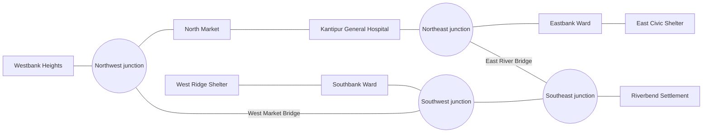

# Kantipur River topology and asset draft

Status: implemented MVP fixture

Scenario ID: `kantipur-river-v1`

Data classification: modeled, synthetic demonstration data

## Purpose

This document defines the fixed physical layout for the ark's first scenario. It is inspired by a dense urban river corridor with development on both banks, limited crossings, congested road approaches, and low-lying riverside roads. It does not represent operational conditions, measured flood risk, or real evacuation guidance for Kathmandu or any other location.

The topology is intentionally small. It must be understandable in a demo while still producing meaningful route changes, hospital-access failures, shelter-capacity tradeoffs, and at least one community-isolation outcome.

## Terrain model

- A river separates northern and southern urban districts.
- Dense local streets feed into one northern and one southern response corridor.
- Two bridges provide the only cross-river connections.
- The southern corridor and eastern river bend are the lowest modeled areas.
- The hospital sits on the northern corridor.
- One shelter sits on higher ground on each side of the river.
- Riverbend Settlement has two baseline escape paths, but both depend on chokepoints that can be lost later.

Elevation bands are relative scenario labels only. They are not surveyed elevations.

## Topology

The graph is connected under baseline conditions. Riverbend Settlement becomes isolated only when both its eastern bridge route and western southern-corridor route are unavailable. This gives the later flood frames and injected disruption clear, testable consequences without making the baseline fragile.

## Asset table

All IDs are stable machine identifiers. Display names must never be used to join scenario data.

### Communities

| ID | Display name | Graph node | Bank / zone | Elevation band | Modeled population | Scenario role |
| --- | --- | --- | --- | --- | ---: | --- |
| `ktp-com-01` | Westbank Heights | `ktp-node-com-01` | North / west | High | 760 | Western community with direct access to the north corridor and west bridge. |
| `ktp-com-02` | North Market | `ktp-node-com-02` | North / central | Medium | 1,180 | Dense community between the west bridge and hospital. |
| `ktp-com-03` | Eastbank Ward | `ktp-node-com-03` | North / east | Medium | 940 | Eastern community with direct access to the east shelter. |
| `ktp-com-04` | Southbank Ward | `ktp-node-com-04` | South / west | Low | 1,060 | Southern community with nearby shelter access and a route to the west bridge. |
| `ktp-com-05` | Riverbend Settlement | `ktp-node-com-05` | South / east bend | Very low | 620 | Intended first-isolation community when both eastern exits are lost. |

Total modeled population: 4,560.

### Critical facilities

| ID | Type | Display name | Graph node | Bank / zone | Elevation band | Modeled capacity | Scenario role |
| --- | --- | --- | --- | --- | --- | ---: | --- |
| `ktp-hospital-01` | Hospital | Kantipur General Hospital | `ktp-node-hospital-01` | North / central | Medium-high | Not used as shelter capacity | Critical destination whose accessibility is scored separately. |
| `ktp-shelter-01` | Shelter | West Ridge Shelter | `ktp-node-shelter-01` | South / west | High | 1,300 people | Primary refuge for Southbank Ward and the western side. |
| `ktp-shelter-02` | Shelter | East Civic Shelter | `ktp-node-shelter-02` | North / east | High | 1,700 people | Primary refuge for the north and east communities. |

Combined modeled shelter capacity: 3,000 people. The capacity is intentionally lower than the total scenario population so future plans must prioritize rather than assume everyone can occupy a shelter at once.

### Bridges

| ID | Display name | Graph connection | Relative exposure | Scenario role |
| --- | --- | --- | --- | --- |
| `ktp-bridge-01` | West Market Bridge | `ktp-node-junction-nw` to `ktp-node-junction-sw` | Medium | Western cross-river alternative and candidate injected-failure asset. |
| `ktp-bridge-02` | East River Bridge | `ktp-node-junction-ne` to `ktp-node-junction-se` | High | Fast route from Riverbend Settlement toward the hospital and east shelter. |

## Road and bridge edges

Travel times are deterministic modeled baseline minutes. Flood penalties and closure thresholds are stored on each edge in `road-network.geojson`; time-indexed depths are supplied by `flood-frames.json`.

| Edge ID | Type | From | To | Baseline minutes | Topology purpose |
| --- | --- | --- | --- | ---: | --- |
| `ktp-road-01` | Road | `ktp-node-com-01` | `ktp-node-junction-nw` | 5 | Connects Westbank Heights to the northern corridor. |
| `ktp-road-02` | Road | `ktp-node-junction-nw` | `ktp-node-com-02` | 6 | Western approach through North Market. |
| `ktp-road-03` | Road | `ktp-node-com-02` | `ktp-node-hospital-01` | 5 | Direct North Market hospital route. |
| `ktp-road-04` | Road | `ktp-node-hospital-01` | `ktp-node-junction-ne` | 5 | Hospital connection to the eastern corridor. |
| `ktp-road-05` | Road | `ktp-node-junction-ne` | `ktp-node-com-03` | 5 | Eastern community approach. |
| `ktp-road-06` | Road | `ktp-node-com-03` | `ktp-node-shelter-02` | 4 | Direct Eastbank Ward shelter route. |
| `ktp-road-07` | Road | `ktp-node-shelter-01` | `ktp-node-com-04` | 4 | Direct Southbank Ward shelter route. |
| `ktp-road-08` | Road | `ktp-node-com-04` | `ktp-node-junction-sw` | 5 | Connects Southbank Ward to both southern and bridge routes. |
| `ktp-road-09` | Road | `ktp-node-junction-sw` | `ktp-node-junction-se` | 9 | Low southern river corridor and one of Riverbend's two exits. |
| `ktp-road-10` | Road | `ktp-node-junction-se` | `ktp-node-com-05` | 4 | Riverbend access spur; remains usable until its exits are lost. |
| `ktp-bridge-01` | Bridge | `ktp-node-junction-nw` | `ktp-node-junction-sw` | 2 | West Market Bridge crossing. |
| `ktp-bridge-02` | Bridge | `ktp-node-junction-ne` | `ktp-node-junction-se` | 2 | East River Bridge crossing. |

All edges are bidirectional in the baseline scenario. Directional controls, congestion, and dynamic traffic behavior are outside the first milestone.

## Access semantics for later routing work

- Shelter access and hospital access are calculated separately.
- A community is isolated only when it has no traversable path to either open shelter and no traversable path to the hospital.
- A bridge is represented as an infrastructure asset and a graph edge with the same ID.
- GeoJSON geometry is for map placement; explicit `from_node_id` and `to_node_id` fields define graph connectivity.
- Closures and penalties will be derived from flood inputs and deterministic rules rather than stored as conclusions in these topology fixtures.

## Draft acceptance checks

- Exactly five communities, two bridges, one hospital, and two shelters are defined.
- Every asset has one stable ID and one graph reference.
- The baseline graph is connected.
- Every community can reach a shelter and the hospital at baseline.
- Each bank has access to at least one shelter without crossing a bridge.
- Riverbend Settlement has two baseline exits and a deterministic two-chokepoint isolation condition.
- The topology supports bridge failure, hospital-access loss, rerouting, shelter overload, and community isolation without changing the graph design.

## Implemented companion fixtures

- `assets.geojson`: community, facility, and bridge geometry plus population,
  capacity, and vulnerability-proxy fields.
- `road-network.geojson`: explicit graph connections, travel times, and closure
  and penalty thresholds.
- `flood-frames.json`: edge-level depths every three hours from `now` through
  `+24h`; +3h/+9h/+15h/+18h/+21h are labeled linear interpolations between the
  original now/+6h/+12h/+24h anchor frames.
- `response-plans.json`: Plan A/B/C assignments and assumptions.
- `event-stream.json`: the injected East River Bridge failure at `+12h`.

The baseline flood progression isolates Riverbend at `+24h`. Injecting the
bridge failure after the southern corridor closes accelerates that isolation to
`+12h` and forces all three plans to be recomputed.
